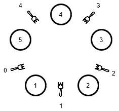

# Report

2015231448 Oleksandr Yakovlyev
2017256029 Gustavo Morgado

## Question 1

Peterson's solution (for two processes) achieves _mutual exclusion_ in a critical section. We verified this property in two ways:
- using a ghost variable and one assert
- using ltl's

## Question 2

In order model the processes stopping, possibly for an unlimited period, we implemented an if statement with two possible branches. The first branch has a skip statement, allowing for the process to continue as normal and request access to the critical region. The second statement stop the process using the logical statement (false). This means that each loop, because of Promela's non-deterministic nature, the process will have a 50-50 chance of either continuing to work as normal or stopping until a timeout.


## Question 3

In order to test the lack of deadlocks in our model, we used following ltl formula:

```
[]( (check[0]==0) -> <>(check[0]==1)) && [] ( (check[1]==0) -> <>(check[1]==1))
```

Each process has a check variable that is incremented after entering the critical region and decremented before leaving it. The ltl formula dictates that every time a check variable is 0 it will eventually become 1. This is only true if the processes can enter the critical section, and, therefore, if there are no deadlocks in the model.
The values of the check variable are also incremented and decremented around the code made in question 2 to ensure that the ltl wouldn't create an error if the processes stoped without wanting to enter the critical region since that is not a deadlock. Since each process has it's own check variable we can do this without having to worry about interferences from the other process. It serves the same purpose as a end label in the if statement. 

## Question 4
The philosophers are modeled by processes, and the forks are modeled by a global integer array _forks_, of size N, such that a philosopher with PID _p_ holding fork _i_ is represented as _forks_[ _i_ ] = _p_.
To be fair and let all philosophers sit at the table at the same time, we start all the processes atomically in the _init_ function.

```
# define N 5
# define LEFT _pid - 1
# define RIGHT _pid % N

int forks[N];

proctype Phil () {
...
}

init {
	byte i;
	atomic {
		for (i : 0 .. N-1){
			run Phil();
		}
	}
}
```

The model has two possible states for each philosopher: thinking and eating. To go from thinking to eating the philosopher must pick up two forks, one at each side.

Our first attempt lets the philosopher pick a fork on his left or right, at random, but he can only eat when both forks are in his possession. We implemented this with a do loop with three (possibly blocking) alternatives, corresponding the following options:

1. if free, pick the left fork
2. if free, pick the right fork
3. if has both forks, proceed to eat

The corresponding code:

```
proctype Phil(){
    do
	::
		// THINK
		printf("philosopher %d thinks ...\n" , _pid );
		
		short nforks = 0;
		/* pick up left and right forks if available */
		do
		::	forks[LEFT] == 0 -> 
				forks[LEFT] = _pid;
				nforks++;
		::	forks[RIGHT] == 0 ->
				forks[RIGHT] = _pid;
				nforks++;
		::	nforks == 2 -> break;
		od
		
		// EAT		
		printf("philosopher %d eats ...\n" , _pid );
		
		/* put the two forks down */
		forks[LEFT] = 0;
		forks[RIGHT] = 0;
	
	od
}
```

The idea is that the philosophers only pick up a fork if no one is holding it - in practice we have a guard (ex: `forks[LEFT] == 0`) that blocks the action of assigning the fork the current philosopher (ex: `forks[LEFT] = _pid`). The loop can only break if the number of forks held is two.
As expected, the output _seems_ to be correct, but as the following questions will demonstrate it is not. This is because the evaluation of the guard and the execution of the guarded statements is not an atomic operation, meaning that two or more philosophers could evaluate the guard to `true` before any of them had time to claim ownership.

## Question 5 and 6
Correctness properties:
* there may never be any single fork being held by more than one philosopher simultaneously
* every philosopher only eats when holding both the left and the right fork

The first property can be verified by asserting that, between the moment that the fork is explicitly picked up and consequently put down, it's always held by the same philosopher.

```
forks[LEFT] = _pid;             // pick up the fork
...
assert(forks[LEFT] == _pid);
...
forks[LEFT] = 0;                // put down
```

The same is applied to both left and right forks and, at this point, the second property is also verified:
```
assert(forks[LEFT] == _pid && forks[RIGHT] == _pid);
```

We ran the verification with the -E flag to disable invalid end states checks (because at this point deadlocks are a problem) and, as expected, the assertion failed.
After examining the detailed output from the guided run option the problem was evident:

```
Process  | n.forks |       forks        |                                         
              P5   |[0] [1] [2] [3] [4]| 
---------------------------------------|                   
5 Phil:       0    | 5   2   3   4   0 |         
5 Phil:       1    | 5   2   3   4   0 |         
5 Phil:       1    | 5   2   3   4   0 |    <-- Process 5 acquired left fork 4
4 Phil:       1    | 5   2   3   4   5 |    <-- Process 4 acquired right fork 4 even if held by 5
5 Phil:       1    | 5   2   3   4   4 |    <-- Process 5 still thinks he has two forks, increments n. forks to 2
4 Phil:       2    | 5   2   3   4   4 |         
5 Phil:       2    | 5   2   3   4   4 |         
spin: philosophers.pml:31, Error: assertion violated
spin: text of failed assertion: assert(((forks[(_pid-1)]==_pid)&&(forks[(_pid%5)]==_pid)))
                                        ...
```
_(the output is slightly modified to fit the screen)_

As we can see, no synchronization means that even tough there is a guard (`forks[LEFT] == 0`) we do not have mutual exclusion. 
Both process 4 and 5 checked the guard and saw that fork 4 was free, and both went into the guarded statements, as predicted.
Philosopher 5 claimed ownership and that was overridden right away by Philosopher 4.

In conclusion, both properties were violated. Philosopher 4 took a fork that was already in use (property 1) and Philosopher 5 was ready to eat even though he didn't have both forks (property 2).

## Question 7
In this iteration of the program we implemented mutual exclusion for each fork resource.
Initially we thought that this was a problem of synchronization between N processes, but even though each fork is a shared resource, it is only ever accessed by two philosophers. This means that what we have is many instances of synchronization for N=2 processes, which can be solved with the provided Peterson's algorithm.

We implemented two functions, `lock(n)` and `unlock(n)`, that as the names suggest, create a critical region accessible only by the processes that currently holds the lock. This way each philosopher has to acquire the lock _n_ before picking up the fork _n_.

Auxiliary functions:
```
# define FK(a) ((_pid - (a)) % N)

bool flag[N*2];
# define MAT(i,j) flag[(i)*2+(j)]

bool turn[N];

inline lock(n){
	MAT(n,FK(n)) = 1;
	turn[n] = 1- FK(n);
	(!MAT(n,1- FK(n)) || turn[n] == FK(n));
	
}

inline unlock(n){
	MAT(n,FK(n)) = 0;
}
```

Inner loop changes: now, each philosopher acquires the lock before writing to the `forks` array
```
...
proctype Phil () {
    ...
        // Inner loop changes
		do
		::	forks[LEFT] != _pid -> 
				lock(LEFT);
				forks[LEFT] = _pid;
				nforks++;
				
		::	forks[RIGHT] != _pid ->
				lock(RIGHT);
				forks[RIGHT] = _pid;
				nforks++;
				
		::	nforks == 2 -> break;
		od
	...

    // Release both forks in the end   
    unlock(LEFT);
    unlock(RIGHT);
	
}

```

With this solution the random simulation output was one of the two: 
* invalid-end statement : there was a deadlock
* depth-limit reached: we tried with MAX_STEPS 2500 and MAX_DEPTH 200_000 and there were no deadlocks (so far) and no assertion violations.

The verify option ended on an invalid end state, but when run with the -E flag (disables invalid end state checks) we always had the max depth too small error, but no assertions error.
...

## Question 8

In order to test for deadlock freedom, we simply used Spin's verify with invalid end states turned on. Using this configuration if the processes are blocked and haven't reached the closing brackets(end state), Spin will produce a invalid end state error. Since in our model there are no acceptable states for a process to block on, we don't need end labels.
We tested it against our current model and got a invalid end state error. After some consideration, we realized this happened because while accessing each fork was mutually exclusive, the order in which the forks where accessed was random and there was nothing stoping a process of getting permanently stuck waiting for access to a fork if another process didn't release it. It was therefore possible to reach a deadlock where processes were all blocking each other.

## Question 9
To avoid deadlocks, we decided to implement an order on the avaiable forks and make it so that all philosophers pick the fork with the lowest number first, corresponding to their position.

Here is a diagram for better visualization:



By making this, all the philosophers will pick up the left fork, with the exception of the fifth philosopher, who will try to reach the right fork. Since he is waiting for that fork to be avaiable, the philosopher at his left will then be able to pick the other fork and eat, making it so that there will never be a situation where none of them will eat. This will also uphold the property of them being silent, since there is no need for communication between them.
## Question 10
